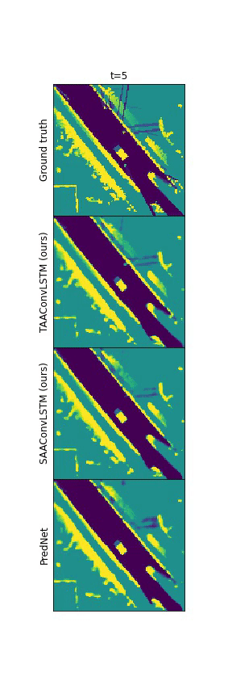
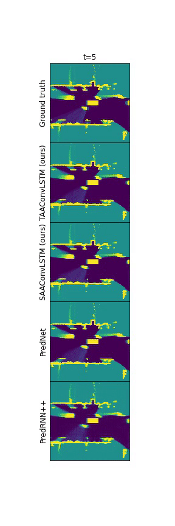

# AttentionAugmentedConvLSTM

Implementation of TAAConvLSTM and SAAConvLSTM used in "Attention Augmented ConvLSTM for Environment Prediction" by Bernard Lange, Masha Itkina, and Mykel J.Kochenderfer.

TAAConvLSTM and SAAConvLSTM are attention augmented ConvLSTM mechanisms motivated by the limited long-range dependencies between hidden representations resulting in the vanishing of moving objects and poor spatial dependcies in the hidden representations. 

 

We test it as part of the PredNet architecture (Lotter W, Kreiman G, Cox D., 2016). The comparison of the predictions is shown below.

## Setup
- Python 3.7
- Libraries: PyTorch (1.4.1/cudatoolkit=10.1) + tensorboard + numpy + scikit-image + math + yaml + argparser + hickle.\
- Tested in Ubuntu + Nvidia RTX 2080Ti with CUDA (10.1).

## Datasets
We run experiments on: [KITTI](http://www.cvlibs.net/datasets/kitti/raw_data.php), [Waymo](https://waymo.com/open/).\
Dataset processing according to: https://github.com/mitkina/EnvironmentPrediction.
Modify the config in the configs file with a path to the preprocessed dataset.

## Training & Inference
The procedure to train the models and make inference are described in the README.md files in the Code/PredNet_(TAA/SAA)ConvLSTM folder.

## References 

Lotter, W., Kreiman, G. and Cox, D., 2016. Deep predictive coding networks for video prediction and unsupervised learning. 

Bello, I., Zoph, B., Vaswani, A., Shlens, J. and Le, Q.V., 2019. Attention augmented convolutional networks. In Proceedings of the IEEE International Conference on Computer Vision (pp. 3286-3295).

Itkina, Masha, Katherine Driggs-Campbell, and Mykel J. Kochenderfer. Tensorflow implementation of "Dynamic Environment Prediction in Urban Scenes using Recurrent Representation Learning." https://github.com/mitkina/EnvironmentPrediction

Myeongjun Kim Attention Augmented Conv2d Pytorch implementation (AAConv2d.py): https://github.com/leaderj1001/Attention-Augmented-Conv2d

